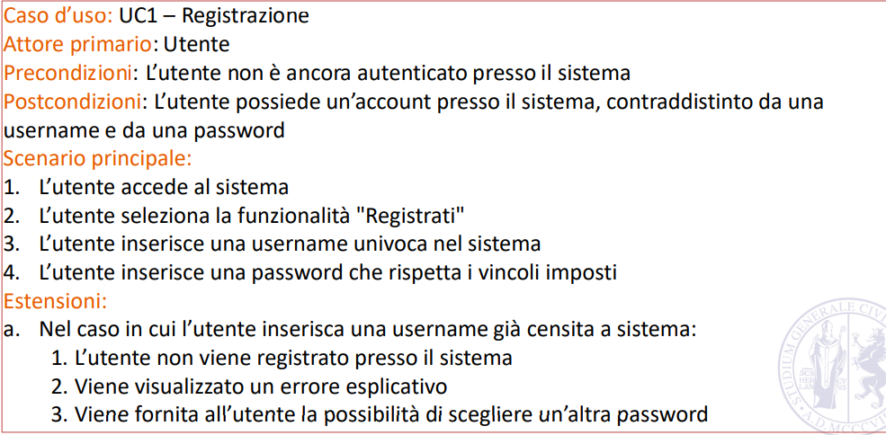
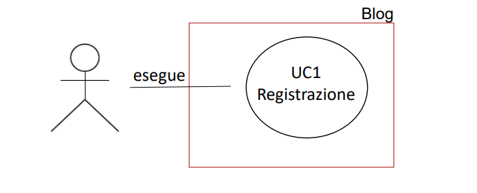
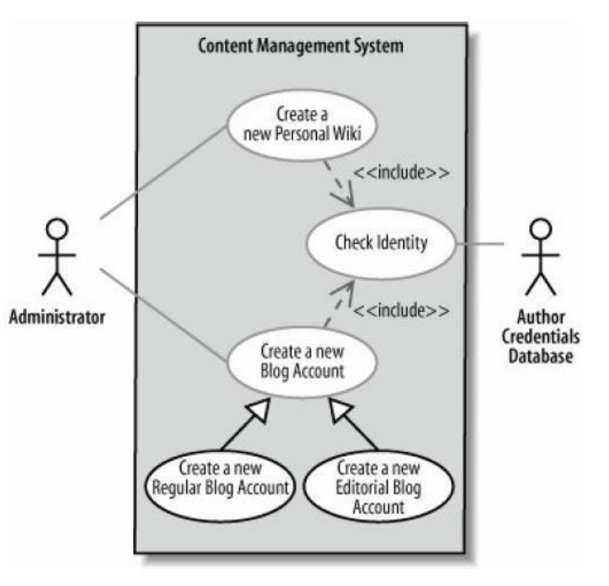
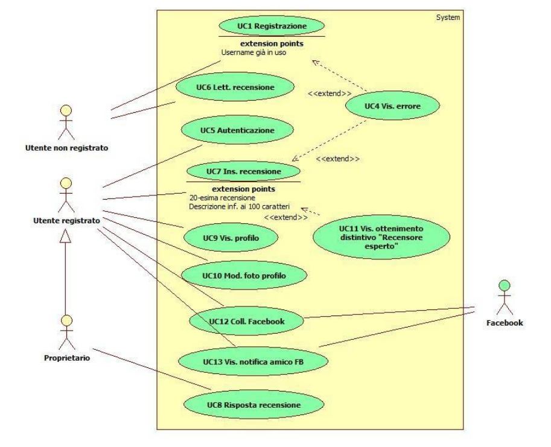

# Casi d'Uso

I casi d'uso possono essere rappresentati tramite UML (Use Case Diagram, diagrammi comportamentali) oppure tramite Testo.

Vengono utilizzati durante la fase di Revisione dei Requisiti.

Serve per individuare i requisiti funzionali e descrivono le interazioni del sistema e degli utenti.

Risponde alle domande:

* Come il sistema deve essere utilizzato?
* Che funzionalità espone?

Servono per descrivere le funzionalità del sistema dal punto di vista dell'utente

## Definizione

Un caso d’uso è un insieme di scenari (sequenze di azioni) che hanno in comune uno scopo finale (obiettivo) per un utente (attore).

## Scenari

Sono una sequenza di passi che descrivono interazioni tra gli utenti e il sistema

Descrivono i possibili eventi che possono accadere all'interno del programma

Tutti gli scenari hanno uno scopo ben definito

## Attori

Sono gli utenti che interagiscono con il sistema.

Gli attori possono essere persone fisiche o altri sistemi.

Gli attori svolgono il caso d'uso per raggiungere l'obbiettivo.

Un attore può svolgere più casi d'uso e un caso d'uso può essere svolto da più attori.

## Contenuto degli Use Case (testo)

## Diagrammi degli Use Case

È un diagramma che mette in evidenza gli attori e i servizi del sistema.

I nodi del grafo sono:

* Attori
* Use Case

Gli archi del grafo rappresentano:

* La comunicazione tra gli attori e gli use case
* Legami tra use case
  * Estensione
  * Inclusione 
  * Generalizzazione

Questo diagramma individua i confini (i limiti ??) del sistema 

### Componenti use case

#### Include 

Ogni istanza di A esegue B.

A non conose i dettagli di B ma solo il suo risultato.

B non sa di essere include in A

Questo evita le ripetizioni.

#### Extend

A può eseguire B al verificarsi di una certa condizione.
Quando viene fatto eseguire B, l'esecuzione di A si interrompe.

Non è la stessa cosa dell'extend in Java !

La condizione di estensione è la condizione secondo la quale viene fatto eseguire B.
La condizione deve essere sempre espressa.

#### Generalizzazione

Se B ha tutte le caratteristiche di A e ne aggiunge delle nuove, allora A è una generalizzazione di B.

## Contesto

Per l'identificazione del contesto bisogna:

* Identificazione attori e responsabilità
* Identificazione degli obbiettivi per ciascun attore
* Individuazione di :
  * Estenzioni
  * Inclusioni
  * Generalizzazioni

## Livelli di Dettaglio

Ci sono 3 livelli di dettaglio:

* Kite Level: molto astratto e definisce macro funzionalità
* Seal Level: livello intermedio, utile nella scoperta di funzionalità nascoste
* Fish Level: livello basso, individua direttamente i requisiti di sistema